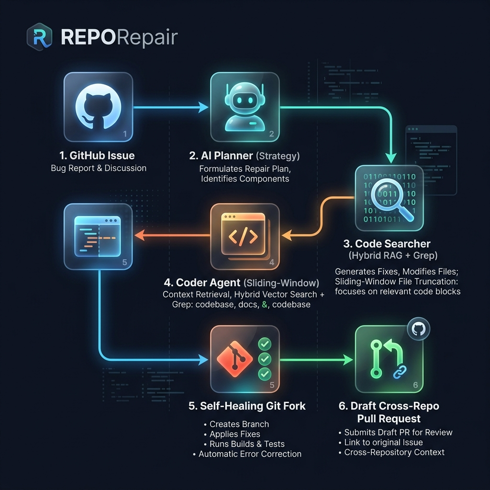

# RepoRepair 🔧

> **RepoRepair** is a state-of-the-art, multi-agent AI RAG system that autonomously analyzes GitHub issues, implements precise codebase fixes, validates changes via testing, and submits tested, cross-repository draft Pull Requests—all without ever auto-merging.

---

## 📊 Core Architecture & Workflow

RepoRepair employs a coordinated team of specialized AI agents built on top of **LangGraph**, **ChromaDB**, and **OpenRouter / Gemini** to execute complex debugging workflows. 



### 🤖 Meet the Agents
1. **The Planner Agent (`agents/planner.py`)**  
   Analyzes the GitHub issue title and description, establishes an engineering fix strategy, and generates a series of semantic and keyword search queries targeted at the bug.
2. **The Searcher Agent (`agents/searcher.py`)**  
   Runs hybrid search (combining ChromaDB vector embeddings with Python keyword matching) to discover relevant source files. Features a **self-healing fallback scanner** that recursively maps out the workspace structure if search results are empty.
3. **The Coder Agent (`agents/coder.py`)**  
   Generates targeted patches for the issue. Features a **smart sliding-window file truncation engine** that analyzes files larger than 400 lines (or 16k chars) and caps prompt context to a precise `+/- 100` line window around the bug's match snippet—saving up to 60% in prompt token overhead and preventing OpenRouter `402 Token Limit` errors.
4. **The Validator Agent (`agents/validator.py`)**  
   Orchestrates isolated test execution inside local Docker containers, ensuring changes do not break existing test suites before PR generation.

---

## ⚡ Recent Innovations & Enhancements

We recently upgraded and optimized RepoRepair to be incredibly robust, self-healing, and production-ready:
* 🌐 **Dynamic OpenRouter Support:** Automatically detects keys with the `sk-or-` prefix, routes requests to `https://openrouter.ai/api/v1`, maps standard model IDs to their OpenRouter equivalents (e.g. `google/gemini-2.5-flash`), and handles low-credit billing blocks.
* 📏 **Token-Aware Sliding Windows:** Optimized Coder Agent to process the **top 3 files** instead of 5, and implemented automatic context window cropping around search hits to respect token limits.
* 🍴 **Fork-First & Cross-Repository PR Pipeline:** Solved standard `403 Forbidden` push errors when attempting to fix public repositories you don't own. RepoRepair now:
  1. Detects if the target repository is owned by another user/org.
  2. Dynamically requests a fork under your GitHub namespace.
  3. Re-routes your local git remote `origin` to point directly to your fork.
  4. Pushes the fix branch to your fork and opens a cross-repository draft PR to the original repository.
* 🖥️ **Windows Stdout Unicode Fix:** Re-routed and sanitized console prints to avoid CP1252 charmap encoding crashes when rendering emojis in standard cmd/PowerShell prompts.

---

## 🔑 GitHub Token & Scopes Guide

> [!IMPORTANT]  
> You **MUST** use a **Classic GitHub Personal Access Token** (starts with `ghp_`).  
> *Fine-grained Personal Access Tokens are locked down by default and do not possess the cross-repository permissions necessary to clone, fork, and push to other users' public repositories.*

### Recommended Scopes:
* **`repo`** (Full control of private and public repositories) — **Strictly Required** for forking, cloning, and pushing fixes.
* **`workflow`** — Required if the fix requires updating GitHub actions or workflow configurations.

Create your classic token here: **[GitHub Classic Tokens Settings](https://github.com/settings/tokens)**.

---

## 🚀 Quick Start

### 1. Prerequisites
* **Python 3.10+**
* **Docker** (for validated isolated test executions)
* **GitHub Classic PAT** (`ghp_...`)
* **OpenRouter / Gemini API Key**

### 2. Installation
```bash
# Clone the repository
git clone https://github.com/tanishbhandari11t/Repo-Repair.git
cd Repo-Repair

# Create and activate virtual environment
python -m venv venv
venv\Scripts\activate  # On macOS/Linux: source venv/bin/activate

# Install dependencies
pip install -r requirements.txt

# Configure environment
copy .env.example .env  # On macOS/Linux: cp .env.example .env
```

Edit the `.env` file to include your API Keys:
```env
GITHUB_TOKEN=ghp_yourClassicTokenHere
GEMINI_API_KEY=sk-or-v1-yourOpenRouterOrGeminiKey
GEMINI_CODING_MODEL=gemini-2.5-flash
```

---

## 💻 Usage

RepoRepair can be run either as a local Web Dashboard or a terminal CLI.

### Web Dashboard (Recommended)
Launch the beautiful, glassmorphic dark-mode dashboard locally:
```bash
python web_app.py
```
Open **[http://localhost:5000](http://localhost:5000)** in your browser to paste issue URLs, connect tokens, and track agent progress live.

### Command Line Interface
```bash
# Run a live fix and submit a draft PR
python -m cli.main fix https://github.com/owner/repo/issues/123

# Dry Run (Generates changes locally but skips pushing/PRs)
python -m cli.main fix <issue-url> --dry-run

# Skip docker test validation (makes execution faster)
python -m cli.main fix <issue-url> --skip-tests
```

---

## 🛠️ Project Directory Layout

```
Repo-Repair/
├── agents/
│   ├── planner.py           # Analyzes issues & plans strategies
│   ├── searcher.py          # Performs hybrid vector searches
│   ├── coder.py             # Generates patches with sliding windows
│   └── validator.py         # Runs test validation suites
├── tools/
│   ├── github_tool.py       # API calls (cloning, forking, draft PRs)
│   ├── git_tool.py          # Git commands (branches, commits, pushing)
│   ├── search_tool.py       # Code indexer and vector searches
│   └── docker_tool.py       # Dockerized test environments
├── templates/
│   └── index.html           # Glassmorphic web dashboard
├── static/
│   ├── css/style.css        # Dashboard styling
│   └── images/              # Infographics & visual assets
├── web_app.py               # Flask application server
└── README.md                # This documentation
```

---

Built with ❤️ using Python, LangGraph, and Google Gemini.
